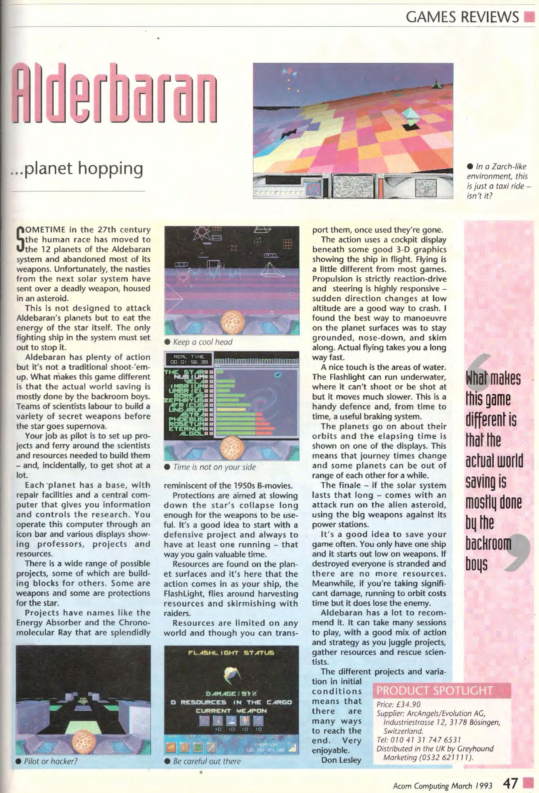
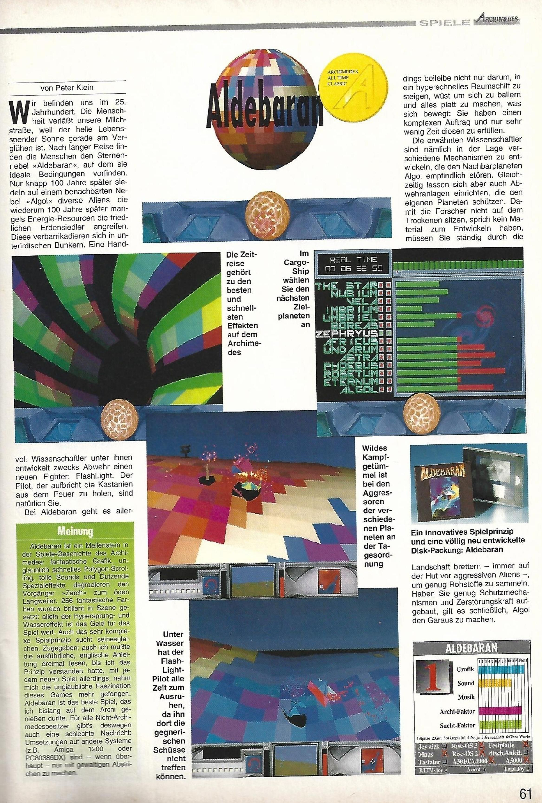
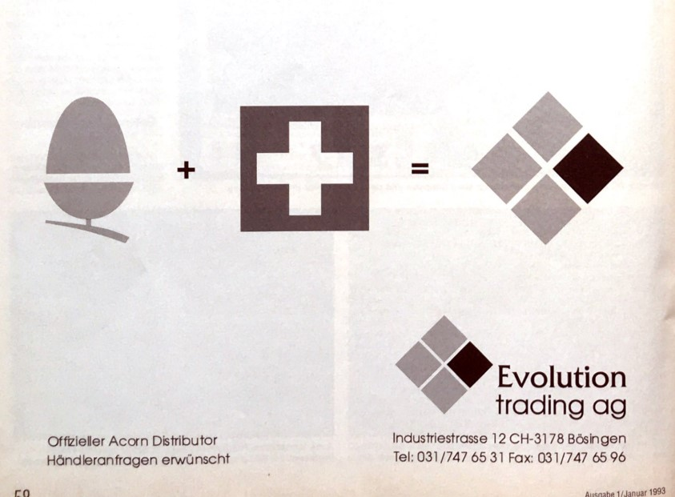
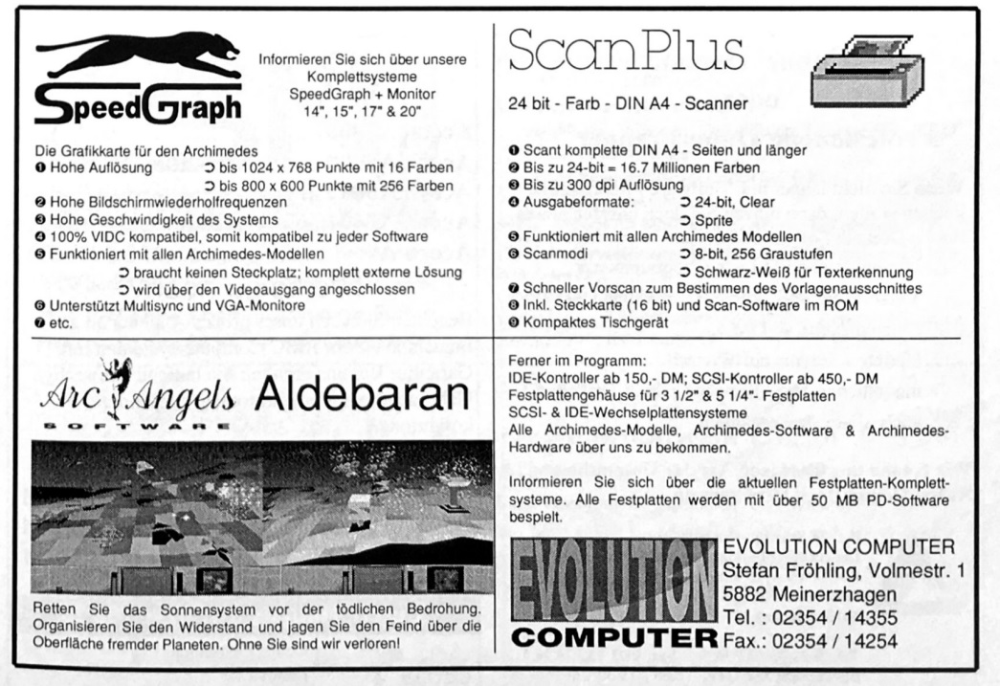
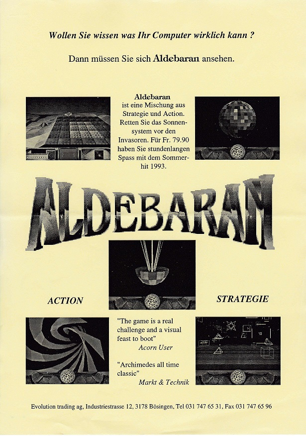

# ALDEBARAN ASSETS (REVIEWS, ADVERTS, ...)

In-game screenshots

---

CD Case (Back)

---

Full-page advert

---

**Source:** Acorn User (7-1992)

**Note:** This is a pre-release article. As written here, the game was originally due to be published by _Eterna_, the french publisher of _Poizone_. But due to its closure, _Aldebaran_ has been published by _Evolution Trading AG_.

---

**Source:** Acorn User (12-1992)

**Credits for Cover Photography:** George Snow

---

**Source:** Acorn User (12-1992)

---

**Source:** Acorn User - Games Supplement (1-1993)

---

**Source:** Acorn User (1-1993)

---

**Source:** Acorn User (11-1993)

---

**Source:** Acorn User - Top 100 Games (1993)

---

**Source:** Acorn Computing (3-1993)

---

**Source:** Acorn Computing (3-1993)

---

**Source:** Acorn Computing (?)

---

**Source:** Risc User (4-1993)

---

**Source:** Archimedes Computer Faszination (2-1993)

---

**Source:** Archimedes Computer Faszination (2-1993)

---

**Source:** Archimedes Computer Faszination (1-1993)

---

**Source:** Archimedes Computer Faszination (1993)

---

**Source:** Archimedes Computer Faszination (2-1993)

---

**Source:** Flyer provided by Marc Andreoli

---

**Source:** https://chrisacorns.computinghistory.org.uk/docs/Acorn/Shows/AcornUser1992Show.pdf
