# DEMOS

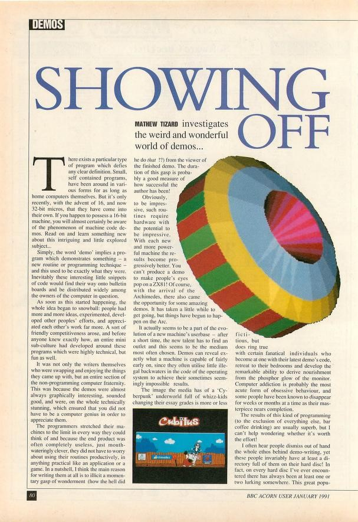
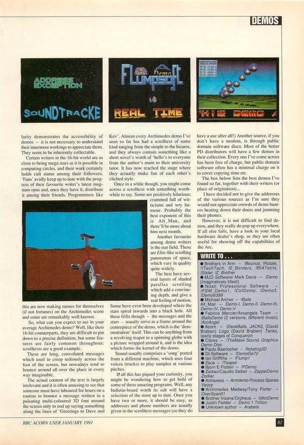

This article mentions **Rotating3D** (displayed on the first page). This was a demo to test 3D rendering routines, later used in **Aldebaran**.

The article also mentions **BallsDemo** by Fabrice Mercier of the Arc Angels team (second page, top right corner).

**Source:** Acorn User (1-1991)

---

# DEMOS SCREENSHOTS

Many small real-time 3D demos were developed in 1991 to test and optimize 3D rendering routines in ARM assembler. These demos have been used as a foundation for developing the game _Aldebaran_, released at the end of 1992. They were also distributed in PD (Public Domain) disks, under the name **Rotating3D**. Of course, more advanced and quick rendering routines were kept private.

The main goals of these demos was to test the following features:

  - drawing triangles (possibly clipped by the screen edges), as quickly as possible
  - face culling
  - directional lighting (per-face)
  - concave objects

**Reminder:** there was no GPU and no FPU (Floating point Unit). All computations are done in 32 bits fidex-point integer or with LUT (Look-Up Tables).

**City** (navigation in a small 3D city)

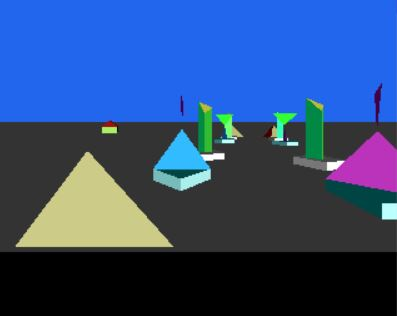
---
**Conca** (test of concave object rendering (no Z-buffer))

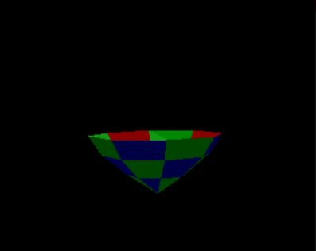
---
**Eye** (rendering of huge object with many polygons)

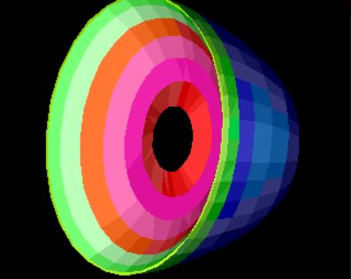
---
**Landscape3** (early terrain renderer)

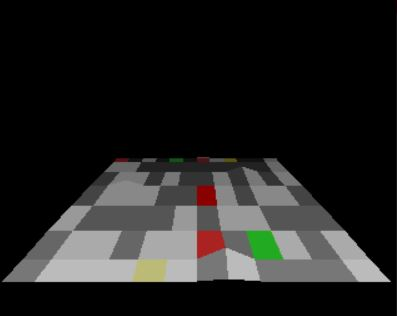
---
**Solid1** (rendering of huge concave object with many polygons (~500))

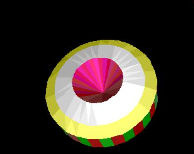

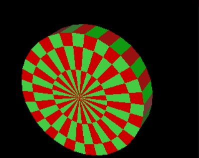
---
**Solid2** (rendering of huge concave object with many polygons (~500))

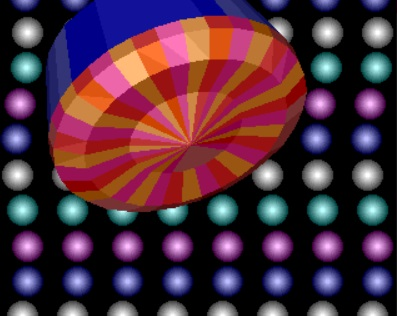
---
**SolidObj2**

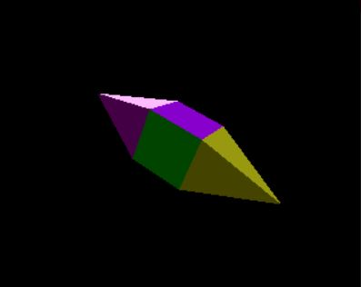
---
**Wow (early terrain renderer)**

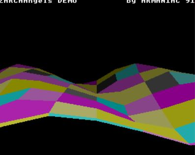
---
**WaterDemo** (image deformations - graphics by Marc Andreoli)

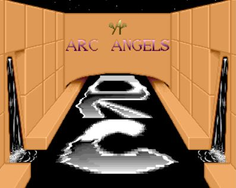
---
**SpinGuin** (small advert for _Aldebaran_ - graphics by Marc Andreoli)

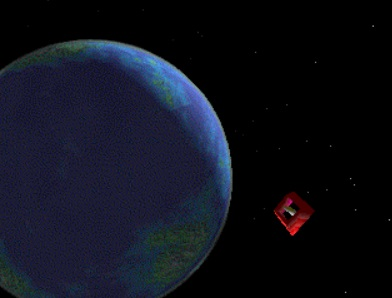
---

These demos can be run from _Arculator_ (an Archimedes Emulator). They have been grouped in the [_PaoloDemos.adf_](../../Demos/PaoloDemos.zip) file.

---

# ARC ANGELS MEGADEMO

Two demos of mine were integrated in the Arc Angels [Megademo](../../Demos/MegaDemo.zip), in 1991.

_Armaniac_ was my nickname as a coder in the Arc Angels team. _Angel Heart_ was the nickname of _Fabrice Mercier_, the team founder.

---
**MegaDemo hub:** Entering a door launches a demo

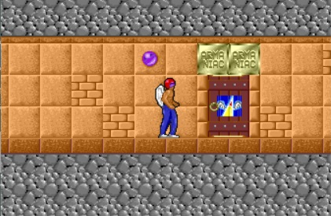
---
**Vectoria Demo** (3D starfields with different shapes)

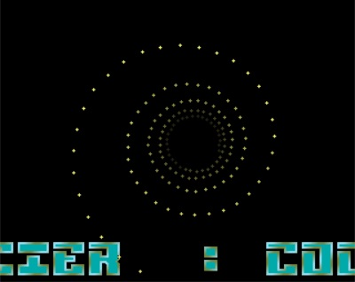
---
**Army Demo** (2D parallax background with overscan + 3D animated object on top)

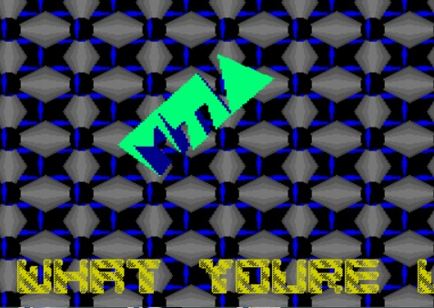

**Note:** called 'Army Demo' because it was developed during my military service period (4 months).
