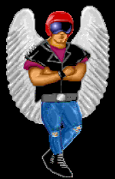

# DEMOS

Many small real-time 3D demos were developed in 1991 to test and optimize 3D rendering routines in ARM assembler. These demos have been used as a foundation for developing the game _Aldebaran_, released at the end of 1992. They were also distributed in PD (Public Domain) disks, under the name **Rotating3D**. Of course, more advanced routines were kept private and used in the game only.

The main goal of these demos was to test the following features:

  - drawing triangles (possibly clipped by the screen edges), as quickly as possible
  - backface culling
  - perspective projection
  - directional lighting (per-face)
  - displaying concave objects (without Z-buffer)
  - Gouraud shading
  - exploiting the fixed 256 colors palette

**Note:** there was no GPU and no FPU (Floating Point Unit) available. All computations were done on CPU in 32 bits fixed-point integer, but no division operation was available. Look-Up Tables (LUT) were used too.

---
**City** (navigation in a small 3D city)

---
**Conca** (test of concave object rendering (no Z-buffer)) - [video](https://youtu.be/WynMQ5Mg4ns).

---
**Eye** (rendering of huge object with many polygons) - [video](https://youtu.be/wZWXxP8721M).

---
**Landscape3** (early terrain renderer) - [video](https://youtu.be/_cHsvOLis8U).

---
**Solid1** (rendering of huge concave object with ~500 polygons) - [video](https://youtu.be/GfaKjsNJI3c).

---
**Solid2** (rendering of huge concave object with ~500 polygons) - [video](https://youtu.be/9sA5GOOiEIw).

---
**SolidObj2** - [video](https://youtu.be/VcK_C9dsmUk).

---
**Wow** (early terrain renderer)

---
**WaterDemo** (image deformations - graphics by Marc Andreoli) - [video](https://youtu.be/PsEBNxQLHvE).

---
**SpinGuin** (small advert for _Aldebaran_ - graphics by Marc Andreoli)

---

These demos can be run from _Arculator_ (an Archimedes Emulator). They have been grouped in the [_PaoloDemos.adf_](../../Demos/PaoloDemos.zip) file. Source code is available in most demos.

[How to run these demos on PC.](./README_HowTo.md)

[Video playlist on YouTube](https://www.youtube.com/playlist?list=PL_A5wPd6o7bN7TXDp6nEtpZL9q25Iq1Ra)

Many thanks to [Icebird](http://www.icebird.org/classics.html) for archiving these demos for so long :smiley:.

---

# ARC ANGELS MEGADEMO

_Arc Angels_ was a demo-maker crew for the _Acorn Archimedes_ in the '90, with members from France, Switzerland and the Netherlands.

_Armaniac_ was my nickname as a coder in the Arc Angels team. _Angel Heart_ was the nickname of _Fabrice Mercier_, the team founder :yellow_heart:.

To my knowledge, the other crew members were: _Marc_ and _Fred_ from Switzerland, _Ace_ from the Netherlands, _Hautecloque_ and _Jean-Eric_ from France.

A MegaDemo is a collection of multiple demos developed by the crew members. Two demos of mine were integrated in the Arc Angels [Megademo](../../Demos/MegaDemo.zip) in 1991.

---
**MegaDemo hub:** Entering a door launches a demo

---
**Vectoria Demo** (3D starfields with different shapes) - [video](https://www.youtube.com/watch?v=oqrJ2RkgYAQ).

---
**Army Demo** (2D parallax background with overscan + 3D animated object on top) - [video](https://www.youtube.com/watch?v=dO2qttN-eqU).

**Note:** called 'Army Demo' because it was developed during my military service period.

---

# PRESS

This article mentions **Rotating3D**. The **Solid1** demo for testing 3D rendering routines (later used in **Aldebaran**) is displayed on the first page.

The article also mentions **BallsDemo** by _Fabrice Mercier_ of the Arc Angels team (second page, top right corner).

**Source:** Acorn User (1-1991)
