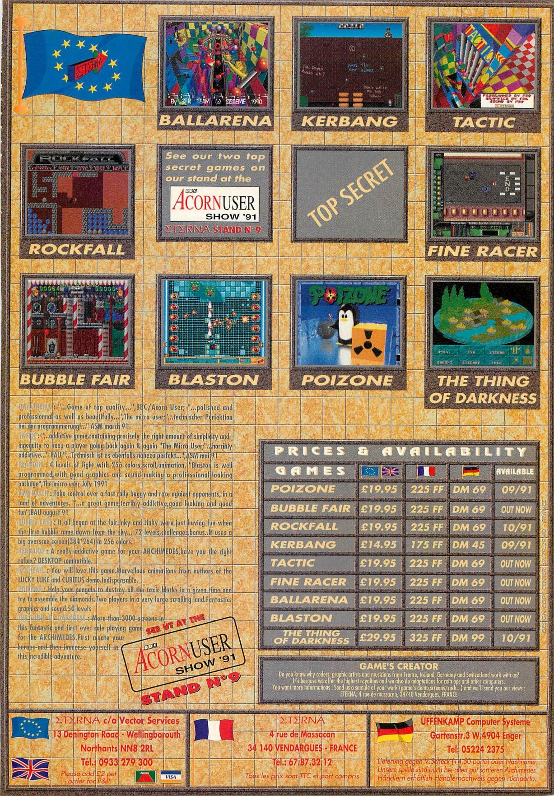

# POIZONE ASSETS

**ORIGINAL BOX**

---
**FRONT**

---
**BACK**

---
**3.5" DISK**

**Note:** Marc ANDREOLI's name is misspelled as ANDREOLLI.

---
**INSIDE**

---
FULL-PAGE ADVERT FOR **ETERNA** GAMES, INCLUDING _POIZONE_.

**Source:** Acorn User (9-1991)

---

**Source:** Vème colloque du [CNJV](https://www.cnjv.fr/colloque/) (Conservatoire National du Jeu Vidéo), Forum des Images, Paris (2-12-2023). _Poizone_ has been mentioned by _Magalie Vetter_, President of [SVGA](https://svga.ch), in the panel _"Sauvegarder le code… Enjeux et solutions ?"_, as an example of source code preservation.
