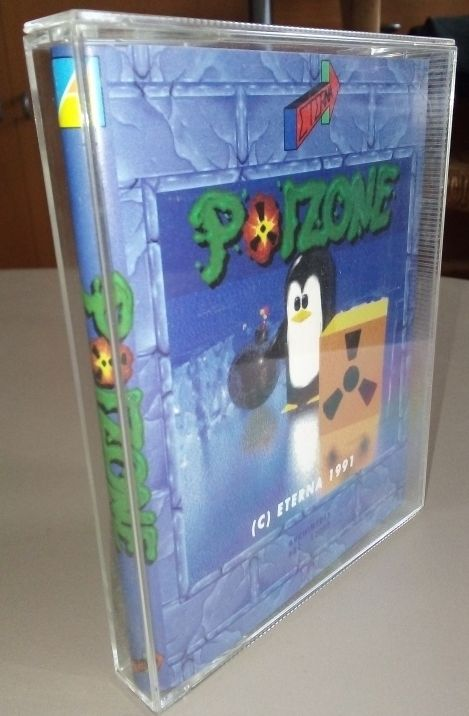
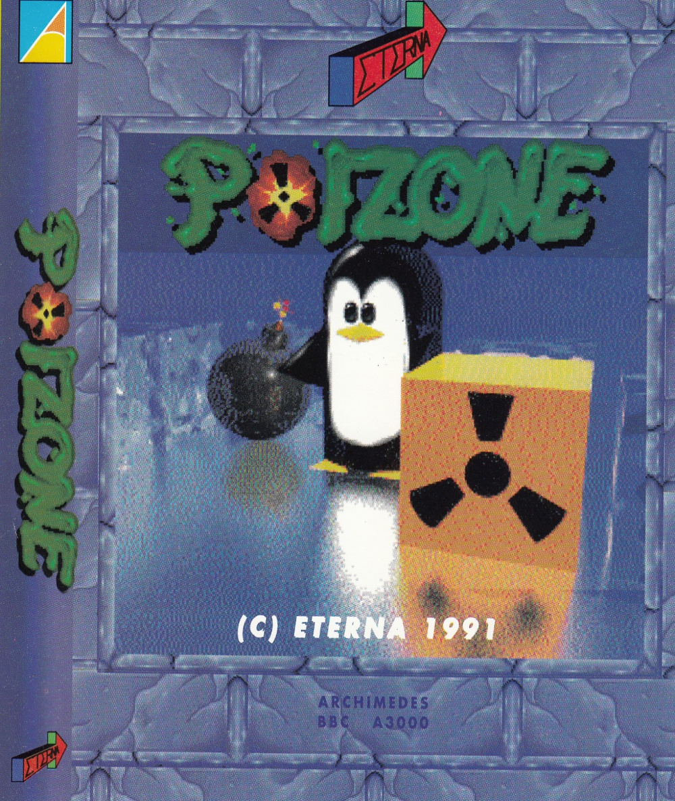
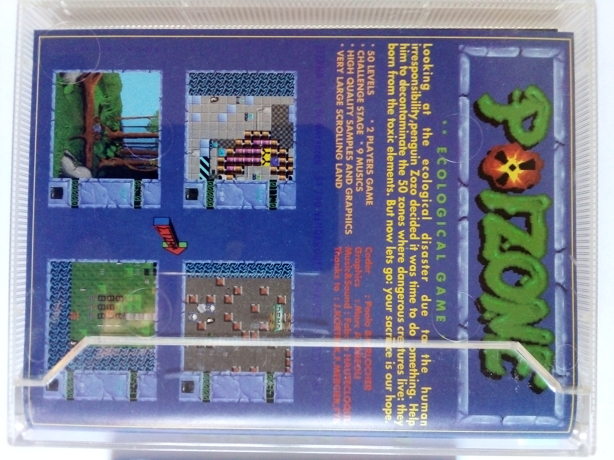
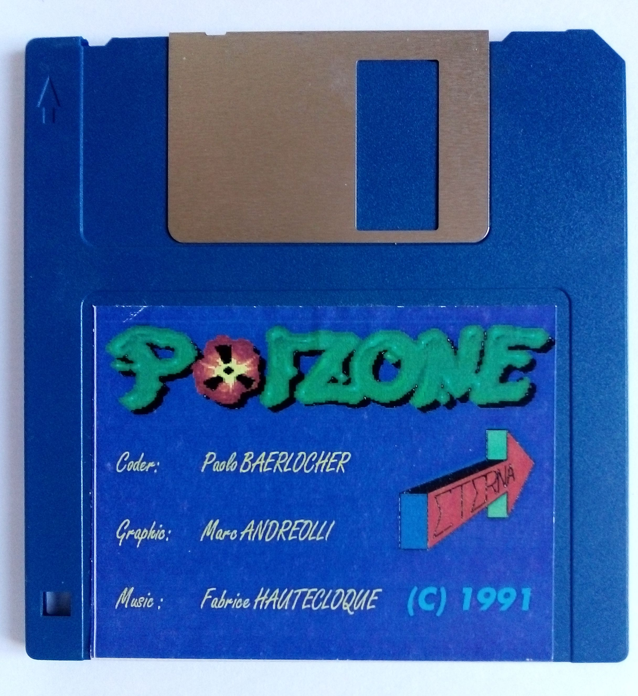
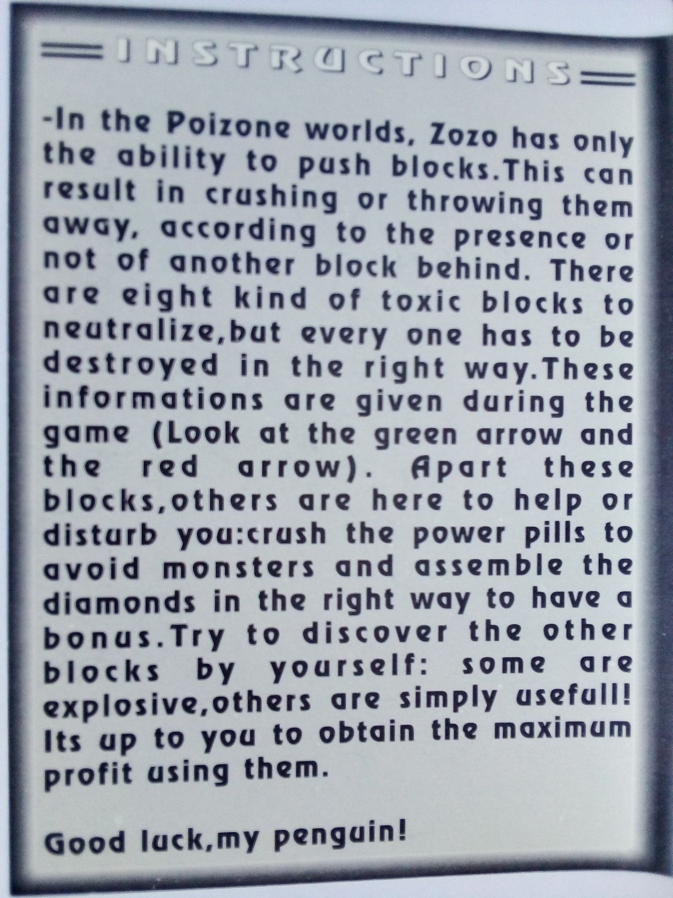
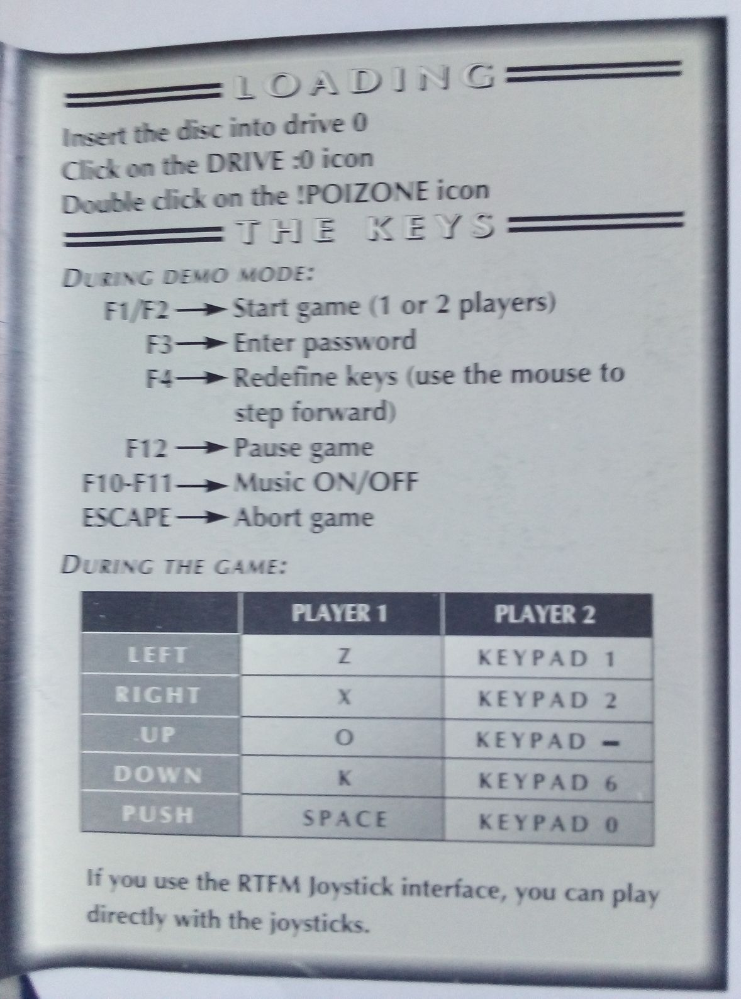
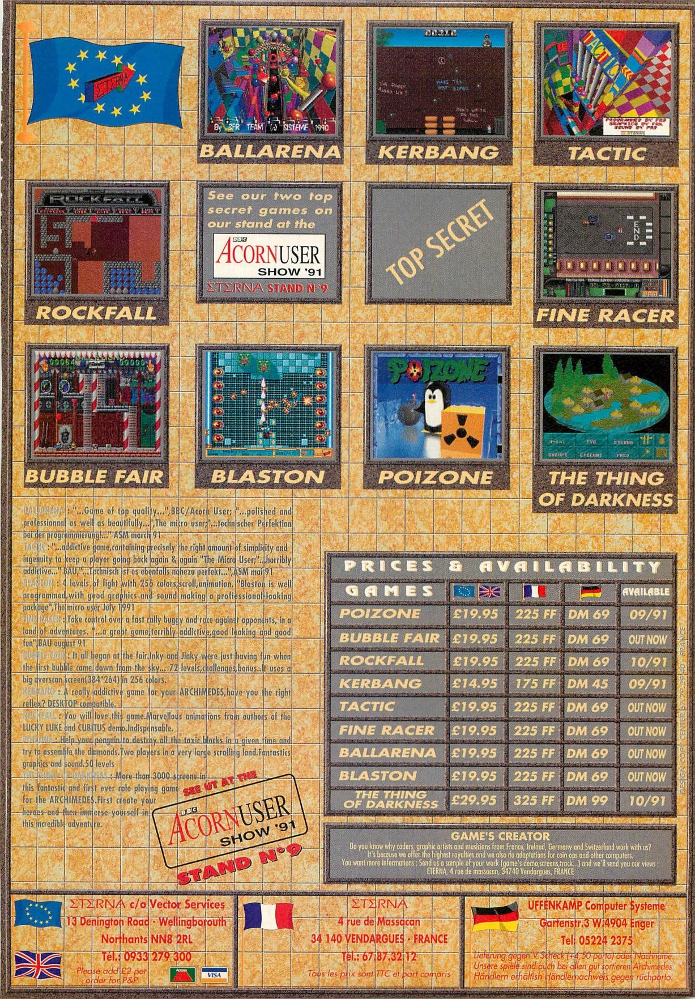
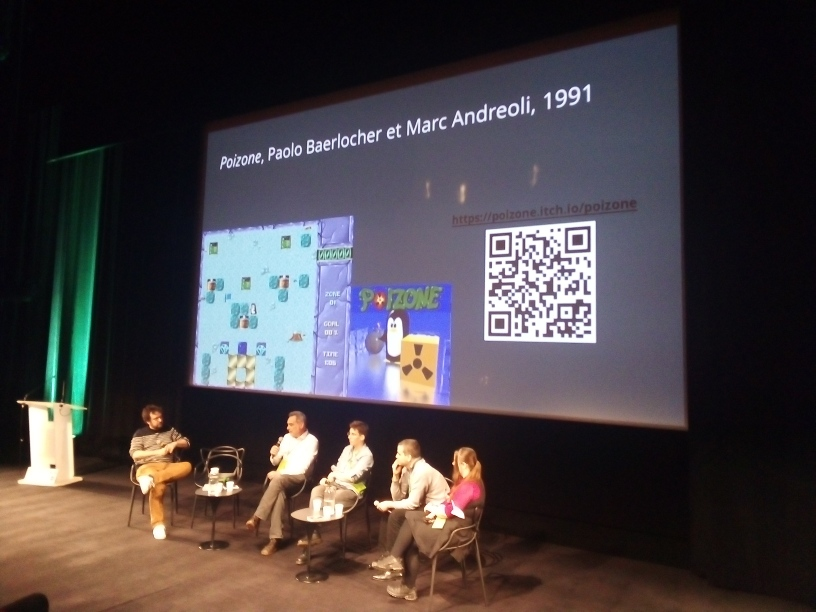

# POIZONE ASSETS

---

---

---

---

---

---
**ETERNA** (Full-page advert for several games, including _Poizone_)

**Source:** Acorn User (7-1992)

---

**Source:** Vème colloque du [CNJV](https://www.cnjv.fr/colloque/) (Conservatoire National du Jeu Vidéo), Forum des Images, Paris (2-12-2023). The game has been mentioned by _Magalie Vetter_, President of [SVGA](https://svga.ch), in the panel called _"Sauvegarder le code… Enjeux et solutions ?"_, as an example of source code preservation.
